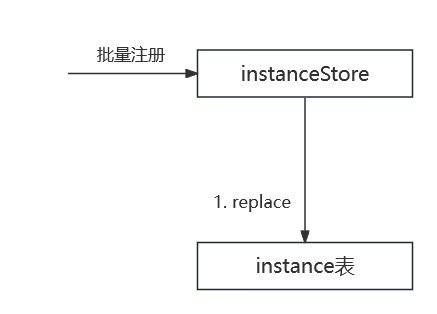

## 背景

​	过去的一段时间，我们在做北极星注册中心模块各接口的性能测试。我们知道，在北极星官方性能测试报告中，实例注册接口的性能测试结果是比较优秀的，我们在做实例注册接口的性能压测时，若实例不带元数据信息注册，测试结果也基本符合官方性能测试报告结论。而当实例带上元数据信息注册时出现性能骤降，体现在TPS大幅下降、平均响应时间大幅上升等，具体测试结果可见[元数据对注册性能影响测试](#元数据对注册性能影响测试)。

​	经排查，我们认为注册过程中与数据库的交互次数过多，且实例相关联的多张表存在索引影响插入性能。故此次优化主要是针对数据库表结构优化，将health_check、instance_metadata表作为字段并入instance表，新字段为health_check_ttl、health_check_type和metadata，去除注册过程中与health_check、instance_metadata表的交互。合并为一张表后，实例注册性能随着元数据条目数增加而增加，如元数据条目数为16时，优化后的性能可达优化前的795.6%，平均响应时间缩短87.4%。同时优化后也能够明显提升查询性能，优化后实例增量查询性能得到284.6%提升。

## 查询性能提升

**优化前：**

​	北极星数据最终一致性的达成，基于数据库的增量同步实现，而实例增量同步判断依据为instance的更新时间mtime。

但在数据库读写分离架构上可能存在以下图示问题：


​	如果分两次查询instance和instance_metadata表，可能会出现图示问题，即查询instance时正常获取数据，但查询instance_metadata时，由于从未同步的从库中查询，导致丢失instance_metadata信息。故优化前的实现需要在一次查询中获取instance和instance_metadata数据，优化前增量查询sql如下：

```sql
select instance.id, service_id, IFNULL(vpc_id,""), host, port, IFNULL(protocol, ""), IFNULL(version, ""), health_status, isolate, weight, enable_health_check, IFNULL(logic_set, ""), IFNULL(cmdb_region, ""), IFNULL(cmdb_zone, ""), IFNULL(cmdb_idc, ""), priority, revision, flag, IFNULL(health_check.type, -1), IFNULL(health_check.ttl, 0), IFNULL(instance_metadata.id, ""), IFNULL(mkey, ""), IFNULL(mvalue, ""),  UNIX_TIMESTAMP(instance.ctime), UNIX_TIMESTAMP(instance.mtime)
	from instance 
	left join health_check on instance.id = health_check.id 
	left join instance_metadata on instance.id = instance_metadata.id 
WHERE
	instance.mtime >= FROM_UNIXTIME(?)
```

基于EXPLAIN ANALYZE结果分析，在执行一次增量获取1000个实例时的结果如下：

```
-> Nested loop left join  (cost=4564.46 rows=18459) (actual time=0.128..12.651 rows=16000 loops=1)
    -> Nested loop left join  (cost=1847.33 rows=1000) (actual time=0.113..3.506 rows=1000 loops=1)
        -> Index range scan on instance using mtime, with index condition: (`instance`.mtime >= <cache>(from_unixtime(1697965150)))  (cost=979.59 rows=1000) (actual time=0.107..2.092 rows=1000 loops=1)
        -> Single-row index lookup on health_check using PRIMARY (id=`instance`.id)  (cost=0.77 rows=1) (actual time=0.001..0.001 rows=1 loops=1000)
    -> Index lookup on instance_metadata using PRIMARY (id=`instance`.id)  (cost=0.87 rows=18) (actual time=0.003..0.008 rows=16 loops=1000)
```

​	上述EXPLAIN ANALYZE结果显示，增量查询关联health_check、instance_metadata表时，会使用nested-loop join(NLJ)算法。在MySQL官网中，对于该算法是这么描述的：

A simple nested-loop join (NLJ) algorithm reads rows from the first table in a loop one at a time, passing each row to a nested loop that processes the next table in the join. This process is repeated as many times as there remain tables to be joined.

Assume that a join between three tables `t1`, `t2`, and `t3` is to be executed using the following join types:

```none
Table   Join Type
t1      range
t2      ref
t3      ALL
```

If a simple NLJ algorithm is used, the join is processed like this:

```clike
for each row in t1 matching range {
  for each row in t2 matching reference key {
    for each row in t3 {
      if row satisfies join conditions, send to client
    }
  }
}
```

Because the NLJ algorithm passes rows one at a time from outer loops to inner loops, it typically reads tables processed in the inner loops many times.

​	由官网对NLJ算法的描述可知，在一次增量实例数据查询时，会首先查询出instance表中数据，再用得到的instance数据分别遍历查找health_check、instance_metadata表中数据。最终得到的结果集为instance结果与instance_metadata表中结果的笛卡儿积，故rows等于18459。

**优化后：**

​	优化后，health_check和instance_metadata作为字段并入instance表中，天然可在一次查询中获取。故查询语句如下：

```sql
select instance.id, service_id, IFNULL(vpc_id,""), host, port, IFNULL(protocol, ""), IFNULL(version, ""), health_status, isolate, weight, enable_health_check, IFNULL(logic_set, ""), IFNULL(cmdb_region, ""), IFNULL(cmdb_zone, ""), IFNULL(cmdb_idc, ""), priority, revision, flag, IFNULL(health_check_type, -1), IFNULL(health_check_ttl, 0), IFNULL(metadata, ""), UNIX_TIMESTAMP(ctime), UNIX_TIMESTAMP(mtime)   
	from instance 
WHERE
	instance.mtime >= FROM_UNIXTIME(?)
```

基于EXPLAIN ANALYZE结果分析，优化后在执行一次增量获取1000个实例时的结果如下：

```
-> Index range scan on instance using mtime, with index condition: (`instance`.mtime >= <cache>(from_unixtime(1699165458)))  (cost=888.21 rows=1000) (actual time=0.028..2.209 rows=1000 loops=1)
```

可见优化后的一次增量查询，只会根据mtime索引查找，查询耗时及查询结果集都大幅减少。

## 注册性能提升

**优化前：**

​	优化前一次批量注册流程如下：


​	在一次批量注册流程中，优化前实现对于instance表和health_check表是使用replace语句更新，对instance_metadata表是先delete，再insert 。MySQL官方文档中对replace语句处理流程解释如下：

 MySQL uses the following algorithm for REPLACE (and LOAD DATA ... REPLACE):

    1. Try to insert the new row into the table
    
    2. While the insertion fails because a duplicate-key error occurs for a primary key or unique index:
    
        a. Delete from the table the conflicting row that has the duplicate key value
    
        b. Try again to insert the new row into the table 

​	即在新增场景下replace语句基本可以看作是insert语句，同时使用replace语句不需要关注数据是否存在，相较于先delete再insert的两次IO请求处理，replace语句只需要一次IO请求即可，用在实例注册场景下非常合适。

​	尽管目前的实现已非常完善，但我们知道，MySQL Innodb会为数据库表的索引创建索引文件，而一般情况下随着索引的增加，该表的插入性能也会相应下降。在北极星实例注册过程中，会写入instance、health_check和instance_metadata表，而这三张表实际上都以instanceId为主键，导致每次实例注册时都会触发这三张表的索引文件写入，降低了插入性能。

​	索引对注册性能的影响可以从删除instance_metadata表中mkey索引的性能对比得出，在相同情况下若instance_metadata不存在mkey索引，性能是存在mkey索引的114.95%。具体性能结果可见[索引删除前后注册性能对比](#索引删除前后注册性能对比)。需要注意的是，若MySQL版本低于8.0不存在[Sorted Index Builds](https://dev.mysql.com/doc/refman/8.0/en/sorted-index-builds.html)策略，那在insert插入索引时，有可能出现页分裂，这将很大程度降低索引的构建和维护性能。本次性能测试对比中MySQL版本为8.0.32。

**优化后：**

​	优化后，由于health_check、instance_metadata表作为字段并入instance表中，故后续对实例的操作集中在instance表，不需要再关心health_check和instance_metadata表。优化后一次批量注册流程如下：



​	后续对实例的操作集中在instance表中。相较于优化前的实现，优化后需要维护的索引数量减少，同时减少了与数据库的交互次数。

## 性能测试结果

### 测试规格

| Polaris规格 | Polaris节点数 | MySQL规格 | MySQL部署规模 | 施压机规格 | 施压机数 | 并发线程数 |
| :---------: | :-----------: | :-------: | :-----------: | :--------: | :------: | :--------: |
|    2C4G     |       2       |   1C4G    |   主备3节点   |    4C8G    |    10    |    1000    |

### 实例注册性能测试

​	为避免其他因素影响，实例注册测试过程中polaris server关闭实例缓存、配置中心、xds server等。以下实例注册性能测试中元数据数指的是单个注册实例携带的元数据条目数，除大字段条件外，其他条件下的元数据key跟value值大小均为10字节，大字段条件的value值为1024字节总计8KB。

#### 优化前后批量注册性能对比

​	测试优化前后注册性能对比。当注册20万实例时，具体测试结果如下表所示。

|            | 元数据数 (字节数) |   TPS    | 平均RT(ms) | 最大RT(ms) | P99 RT(ms) | Polaris CPU | MySQL CPU |
| :--------: | :---------------: | :------: | :--------: | :--------: | :--------: | :---------: | :-------: |
|   优化前   |         0         |   3571   |    282     |    1197    |    510     |     20      |   26.88   |
|   优化后   |         0         |   3636   |    286     |    736     |    481     |     15      |   18.24   |
|   优化前   |     4 (80 B)      |   1242   |    787     |    1599    |    1201    |     19      |   51.39   |
|   优化后   |     4 (80 B)      |   3546   |    285     |    793     |    499     |     21      |   20.08   |
|   优化前   |     8 (160 B)     |   769    |    1291    |    3371    |    1985    |     23      |   73.04   |
|   优化后   |     8 (160 B)     |   3640   |    285     |    858     |    496     |     23      |   21.89   |
|   优化前   |    16 (320 B)     |   412    |    2394    |   12800    |    4423    |     20      |  100.00   |
| **优化后** |  **16 (320 B)**   | **3278** |  **301**   |  **1058**  |  **571**   |   **19**    | **21.95** |
|   优化前   |  8 (大字段 8KB)   |   408    |    2387    |   15789    |    5200    |     22      |  100.00   |
|   优化后   |  8 (大字段 8KB)   |   740    |    1325    |    5803    |    2325    |     33      |   76.73   |

​	由测试结果我们可以得到以下趋势图。结合以上测试数据，可见优化后批量注册的性能随着元数据的增加，基本无明显下降，且MySQL CPU负载也基本一致。在polaris实际运行过程中，大部分实例注册场景将携带一些元数据，即使在携带大字段元数据场景下，优化后的性能也能有明显的提升。


#### 元数据对注册性能影响测试

​	测试优化前元数据对注册性能的影响。当注册20万实例时，具体测试结果如下表所示。

|        | 元数据数 (字节数) | TPS  | 平均RT(ms) | 最大RT(ms) | P99 RT(ms) | Polaris CPU | MySQL CPU |
| :----: | :---------------: | :--: | :--------: | :--------: | :--------: | :---------: | :-------: |
| 优化前 |         0         | 3571 |    282     |    1197    |    510     |     20      |   26.88   |
| 优化前 |     4 (80 B)      | 1242 |    787     |    1599    |    1201    |     19      |   51.39   |
| 优化前 |     8 (160 B)     | 769  |    1291    |    3371    |    1985    |     23      |   73.04   |
| 优化前 |    16 (320 B)     | 412  |    2394    |   12800    |    4423    |     20      |  100.00   |
| 优化前 |  8 (大字段 8KB)   | 408  |    2387    |   15789    |    5200    |     22      |  100.00   |

​	由测试结果我们可以得到以下趋势图。结合以上测试数据，可见在批量注册实例时，随着实例元数据数量的增加，注册性能将大幅降低，体现在TPS大幅下降，响应时间大幅上升，MySQL负载大幅上升等。


#### 索引删除前后注册性能对比

​	测试优化前索引对注册性能的影响。当注册20万实例时，具体测试结果如下表所示。

|                      | 元数据数 (字节数) | TPS  | 平均RT(ms) | 最大RT(ms) | P99 RT(ms) | Polaris CPU | MySQL CPU |
| :------------------: | :---------------: | :--: | :--------: | :--------: | :--------: | :---------: | :-------: |
|        优化前        |     8 (160 B)     | 769  |    1291    |    3371    |    1985    |     23      |   73.04   |
| 优化前(删除mkey索引) |     8 (160 B)     | 884  |    1128    |    2411    |    1721    |     24      |   70.29   |

​	由测试结果可见，当删除instance_metadata表的mkey索引之后，实例的注册性能是未删除mkey索引的114.95%。

### 实例查询性能测试对比

#### 首次全量实例查询性能对比

​	基于基准测试查询20万实例，对比优化前后polaris全量查询实例性能，X轴为parallelism配置。在相同条件下，优化后单次全量实例查询的性能为优化前性能的 212.8%。随着并发度(parallelism)增加，性能提升略有下降，但整体依旧有提升。


具体测试结果如下，总耗时ms=op数*ns/op：

|                  | 并发度 1 | 并发度 5 | 并发度 10 | 并发度 15 |
| :--------------: | :------: | :------: | :-------: | :-------: |
| 优化前(总耗时ms) | 7696.40  | 8973.38  | 23373.59  | 42816.78  |
| 优化后(总耗时ms) | 3616.65  | 5386.49  | 11855.65  | 31953.16  |

#### 增量部分实例查询性能对比

​	基于基准测试增量查询5000实例时(总实例数20万)，对比优化前后polaris增量查询实例性能，X轴为parallelism配置。在相同条件下，优化后增量实例查询的性能约为优化前性能的 284.6%。随着并发度(parallelism)增加，性能提升效果基本不变。


具体测试结果如下，总耗时ms=op数*ns/op：

|                  | 并发度 50 | 并发度 70 | 并发度 100 | 并发度 150 |
| :--------------: | :-------: | :-------: | :--------: | :--------: |
| 优化前(总耗时ms) |  306.84   |  429.73   |   600.26   |   895.87   |
| 优化后(总耗时ms) |  108.73   |  147.36   |   220.20   |  308.466   |

## 小结

​	此次表结构优化能有效提升Polaris的实例注册与查询性能，但在部分场景下也牺牲了一定的灵活性，由于metadata作为字段并入instance表，当未开启缓存时，如果用户希望根据指定元数据归类服务实例，将不得不遍历全量instance数据。最后，经过这段时间对北极星的探索，除了惊喜于北极星的存算分离架构和一系列治理能力外，也由衷感谢北极星团队的耐心解答和积极回应，感谢北极星在云原生领域持续输出的瞩目成果。
